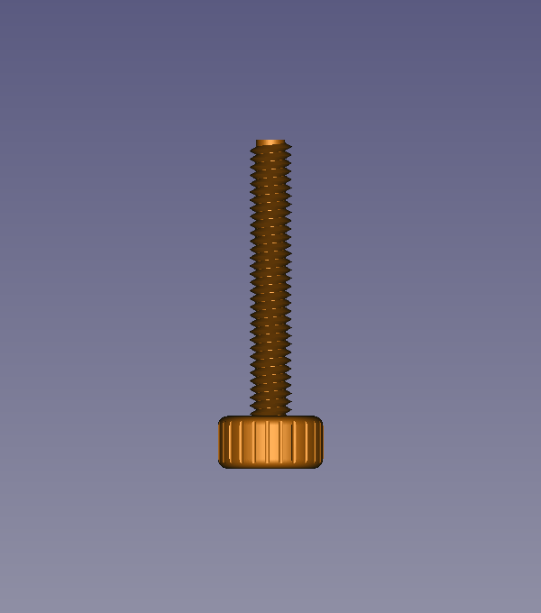

# phone-cage
Modular system for accessory attachments for mobile device photography/videography or other use

### Required Hardware
- 2 [3M x 25mm bolts](https://www.amazon.com/gp/product/B012TE0S6U/ref=ppx_yo_dt_b_asin_title_o00_s01?ie=UTF8&psc=1) and 2 [3M nuts](https://www.amazon.com/gp/product/B071NLDW56/ref=ppx_yo_dt_b_asin_title_o00_s01?ie=UTF8&psc=1)

# Main Cage
The following is the "cage" that will hold the mobile device.  
There contains 3 main parts listed below.

## 1. The Top Cage Mount
The top cage mount featers a mount that can be swapped out with other modular parts. In this case I currently use it with the handle.
# 

## 2. The Bottom Cage Mount

## 3. The Cage Screw

# Modular add-ons 

## Cage Handle

# Acknowledgements
Designs remixed from the follwing projects:
https://www.thingiverse.com/thing:2505243
https://www.thingiverse.com/thing:2450244

